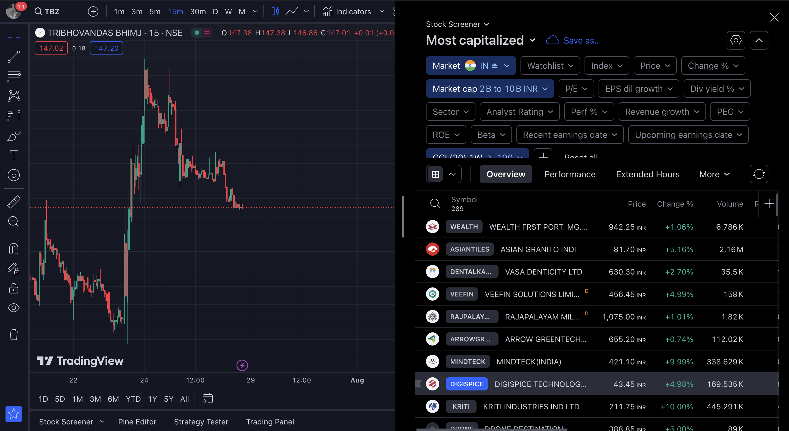

# Rust-TradingView-Stock-Screener

## How to Run

- Clone the repository.
  
  ```shell
  git clone https://github.com/anurag-sachan/Rust-TradingView-Stock-Screener.git
  ```

- Pre-requisites :
  
    > Install and setup Rust
    > & Cargo package manager

    > Navigate to RSS directory containing `main.rs`

    ```shell
    cargo run
    ```


## Screenshot: What it does?

  > Applies filter to multiple sections, all at once, for ex, Market Cap, Fundamentals, Analyst Rating, Indicator (Paid features)

  > Indicator data from Higher to Lower time frame for better insights.

  > For Intraday Stocks, fetches most probable stocks out of available 6000 symbols based on 1D, 15M time frame w/ indicated assistance for sniper entry-exits.

  > Similarly, for Swing Traders, fetches symbols based on Monthly 1M / Weekly 1W time frames.

 


<br/>
Thanks,

Anurag.
